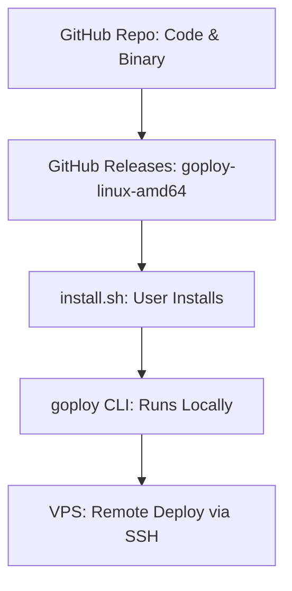

# goploy

A Heroku-lite open-source platform to deploy backend and frontend apps on your VPS with a simple Go CLI.

## GitHub
This project is open-source and published at: [https://github.com/DSwithSiam/goploy](https://github.com/DSwithSiam/goploy)

## Features
- CLI tool with `deploy`, `init`, `destroy`, `logs` commands
- Supports Django, FastAPI, Node, and static frontends
- Auto-generates Nginx and systemd configs
- SSH-based remote deployment


## Installation

1. Install Go (if not already): https://go.dev/doc/install
2. Clone the repo and build the CLI:

```sh
git clone https://github.com/DSwithSiam/goploy.git
cd goploy
go build -o goploy ./cmd/goploy
```

## CLI Commands

- `deploy`   : Deploy an app to your VPS (main workflow)
- `init`     : (coming soon) Initialize a new project
- `destroy`  : (coming soon) Remove a deployed app
- `logs`     : (coming soon) View logs from your app

## How to Deploy with goploy

1. Build the CLI as above.
2. Run the deploy command with your app details:

	**Django Example:**
	```sh
	./goploy deploy --domain example.com --server 1.2.3.4 --project /home/ubuntu/myapp --framework django
	```

	**FastAPI Example:**
	```sh
	./goploy deploy --domain api.example.com --server 1.2.3.4 --project /home/ubuntu/api --framework fastapi
	```

3. Follow the prompts:
	- Enter your SSH username and password for the VPS
	- Enter any environment variables (or leave blank)
	- Answer "y" if you want to deploy a Celery worker

# Goploy

Goploy is an open-source CLI tool (written in Go) that lets you deploy Django and FastAPI apps to your VPS in minutes—Heroku-style, but on your own server.

---

## 🚀 What is Goploy?
Goploy is a production-ready deployment tool for developers who want Heroku-like simplicity but full control. It connects to your VPS via SSH, installs all dependencies, configures Nginx, Gunicorn/Uvicorn, Celery, and more—automatically.

---

## ⚡️ Install (1 line)

```sh
curl -sSL https://raw.githubusercontent.com/DSwithSiam/goploy/main/scripts/install.sh | bash
```

---

## 🛠 Usage Example

Deploy a Django app:
```sh
goploy deploy --domain example.com --server 1.2.3.4 --project /home/ubuntu/myapp --framework django
```

Deploy a FastAPI app:
```sh
goploy deploy --domain api.example.com --server 1.2.3.4 --project /home/ubuntu/api --framework fastapi
```

You’ll be prompted for SSH credentials, .env variables, and Celery worker (optional).

---

## ✨ Features

- One-line install via curl/bash
- CLI tool with `deploy`, `init`, `destroy`, `logs` commands
- SSH-based remote deployment
- Supports Django (Gunicorn), FastAPI (Uvicorn), Celery, Redis
- Auto-generates Nginx and systemd configs
- Uploads .env securely
- No daemon, no agent—runs locally, targets remote VPS

---

## 🧠 How it Works (Simple Flow)



---


## Contributing
PRs and issues welcome! See CONTRIBUTING.md.

---

## License
MIT
